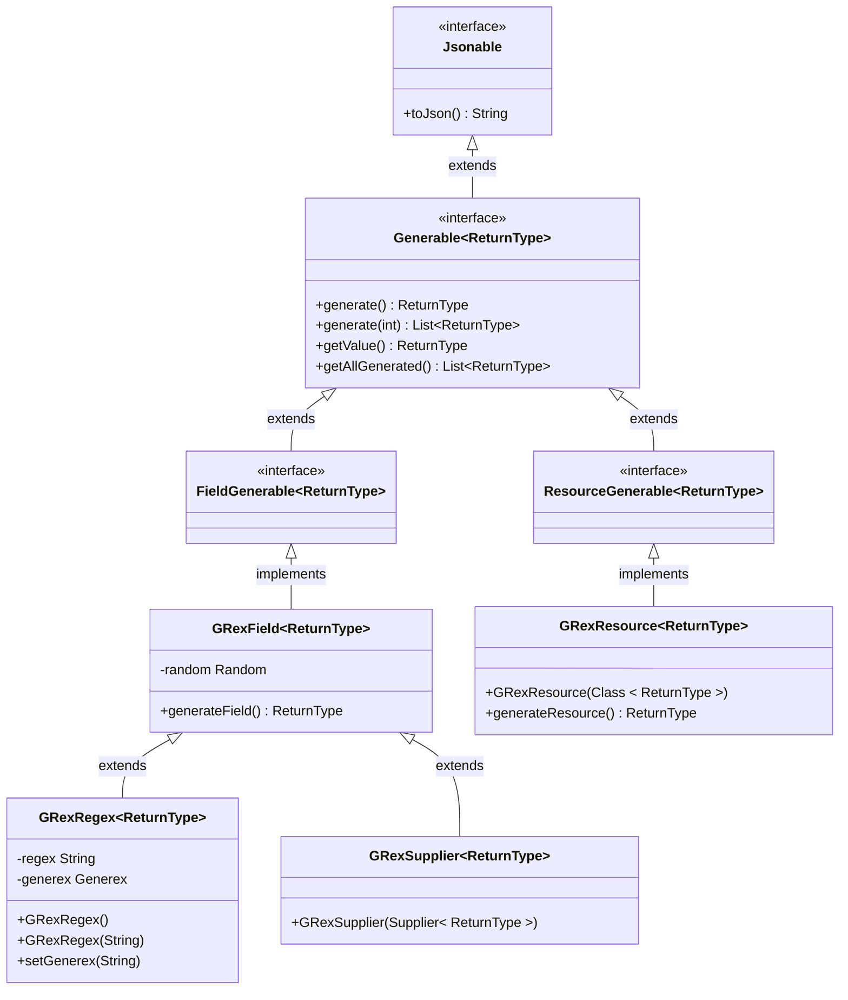
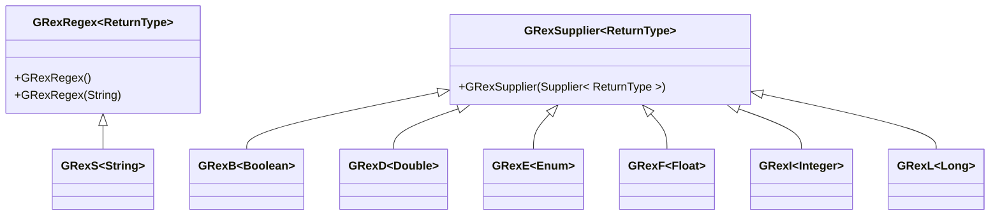

# Gen Rex (GRex)

## Description
Gen Rex (GRex) is a versatile Java library designed for generating a wide range of test data. It supports creating simple data types such as numbers and strings, as well as more complex structures like UUIDs or specific patterns matching regular expressions. GRex is ideal for testing, simulation, and populating databases with mock data, offering extensive customization through regular expressions and custom generation logic.

## Base Abstraction
### Diagram



### `Jsonable` interface
Any class implementing this interface will receive a default implementation of `String toJson()`, which serializes this object into JSON using the Jackson library.

### `Generable` interface
The `Generable` interface is a foundational element of the **GenRex** library, designed to provide a generic way of generating data.
Classes implementing this interface are capable of producing instances or collections of a specified `<ReturnType>`.
#### Methods
The interface defines two methods:

`generate()`: Generates and returns a single instance of `<ReturnType>`.

`generate(int amountToGenerate)`: Generates a list of instances of `<ReturnType>`, with the list size determined by the `amountToGenerate` parameter.

This interface allows for the flexible generation of data, supporting a wide range of testing and mock data creation scenarios.

### `FieldGenerable` Interface
`FieldGenerable` extends the `Generable` interface without adding additional methods. 
It serves as a marker interface to distinguish classes that are specifically designed to generate data for fields within larger data structures or objects. 
This interface emphasizes the role of implementing classes in generating data at the field level, aiding in the modular design of data generators.

### `GRexField` Class
`GRexField` is an abstract class that implements the `FieldGenerable` interface, providing a base for generating data for individual fields. 
It includes a mechanism to track and store generated data, allowing for the retrieval of all values generated during the lifetime of an instance. 
This class is essential for creating custom field generators, offering both a random data generator and a storage solution for generated values.
The generic nature of this class allows us to support the generation of new, random fields for both numeric and String types as well as objects of any class.

### `GRexRegex` Class
Derived from `GRexField`, the `GRexRegex` class specializes in generating data that matches a given regular expression. By allowing users to specify a regex pattern, 
`GRexRegex` enables the creation of highly customizable and constrained data sets suitable for testing a wide range of input validation scenarios. 
The class uses the Generex library to efficiently handle regex-based data generation, ensuring that generated values conform to the specified pattern.

### `GRexSupplier` Class
The `GRexSupplier` class, another concrete implementation of the `GRexField` class, leverages Java's Supplier functional interface to generate data. 
This class allows for the encapsulation of custom generation logic within a Supplier, providing a highly flexible approach to data generation. 
Users can define their own lambda expressions or method references to produce data, making `GRexSupplier` a versatile tool for scenarios where predefined generation strategies are insufficient.

### `ResourceGenerable` Interface
`ResourceGenerable` extends the `Generable` interface without adding additional methods.
It serves as a marker interface to distinguish classes that are specifically designed to generate data resources for fields.
This interface emphasizes the role of implementing classes in generating data at the resource level, aiding in the modular design of data generators.

### `GRexResource` Class
The `GRexResource` class is an abstract implementation of the `ResourceGenerable` interface (an extension of the `Generable` interface), adapted to generate resources implementing the `Generable` interface as well as nesting itself.
Instances of `GRexResource` are designed to handle the generation of resources that require a deeper understanding of the domain model, such as entities in a database or components in a software application.
This class leverages reflection and other advanced techniques to dynamically generate data based on the specified `<ReturnType>`.

### Summary
These components form the core of the **GenRex** library, offering a robust framework for generating mock data, testing inputs, and simulating real-world data scenarios in a flexible and extensible manner.

## Base Fields

The Gen Rex library provides a robust foundation for generating random values, tailored specifically for various data types. These base classes play a crucial role in creating mock data, facilitating testing, and simulating realistic application behaviors. Below is an overview of the key classes dedicated to generating random values for standard data types.

### Diagram



### `GRexS` - String Generator

`GRexS` extends `GRexRegex`, making it a specialized class for generating random `String` values that match a specific regular expression pattern. This feature is particularly useful for generating data that must conform to certain format constraints, such as email addresses, phone numbers, or custom identifiers.

### `GRexB` - Boolean Generator

`GRexB` leverages `GRexSupplier` to produce random `Boolean` values. This class is straightforward yet essential for scenarios requiring a random choice between two possibilities, embodying the simplicity and effectiveness of using suppliers for data generation.

### `GRexD` - Double Generator

Similar to `GRexB`, `GRexD` is based on `GRexSupplier` and focuses on generating random `Double` values. Whether you need numbers for financial calculations, measurements, or any other purposes requiring decimal precision, `GRexD` offers a convenient solution.

### `GRexE` - Enum Generator

`GRexE` also utilizes `GRexSupplier` but is uniquely designed to generate random values from a specified `Enum` type. This functionality is invaluable for testing code paths that depend on enumerable options, ensuring comprehensive coverage across all possible values.

### `GRexF` - Float Generator

`GRexF` follows the pattern set by other numeric generators like `GRexD`, employing `GRexSupplier` to create random `Float` values. It caters to use cases where floating-point precision is sufficient, offering a lightweight alternative to `Double` generation.

### `GRexI` - Integer Generator

For generating random `Integer` values, `GRexI` adopts `GRexSupplier`, presenting a versatile tool for a wide range of applications, from indexing and counting to setting up entities with unique identifiers.

### `GRexL` - Long Generator

Lastly, `GRexL` extends `GRexSupplier` to produce random `Long` values, accommodating situations that demand larger numeric ranges than what `Integer` can provide. It's particularly useful for generating unique IDs, timestamps, and other values requiring extended numeric capacity.

### Summary
Each of these classes is designed with flexibility and ease of use in mind, allowing developers to seamlessly integrate random data generation into their testing and development workflows.


## Used technologies
- Java 17
- Lombok for reducing boilerplate code
- JUnit for unit testing
- Jackson for JSON processing
- AssertJ for fluent assertion
- SLF4J for logging
- Automaton for regular expression operations
- Generex for regular expression-based data generation
- JavaFaker for generating real-like fake data

# Getting Started

## Prerequisites
Ensure you have Java version 17 or newer installed on your system.

## Installation
To use Gen Rex in your project, add it as a dependency in your `pom.xml` file:

```xml
<dependency>
    <groupId>pl.damianlegutko.util</groupId>
    <artifactId>Gen-Rex</artifactId>
    <version>0.1.0</version>
</dependency>
```

# License
This project is licensed under the Apache License 2.0. For more details, see the LICENSE file or visit [http://www.apache.org/licenses/LICENSE-2.0](http://www.apache.org/licenses/LICENSE-2.0).